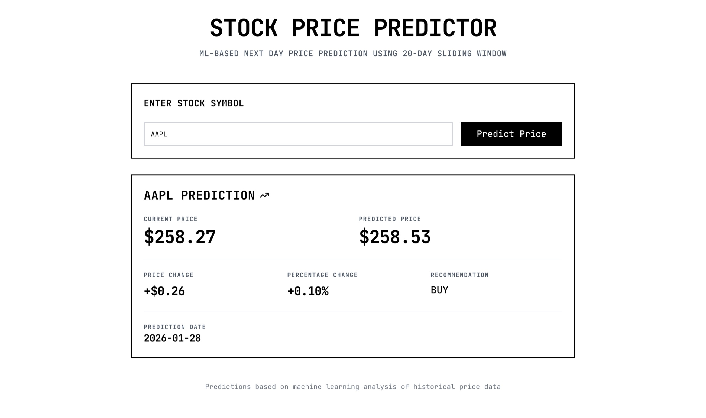
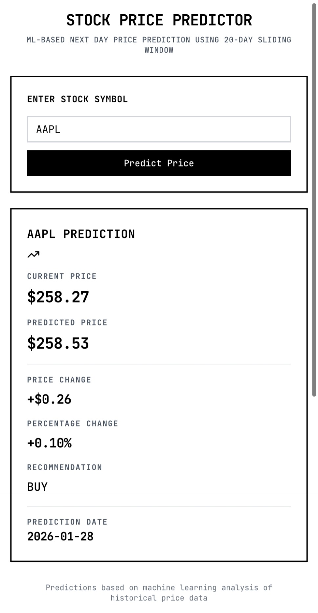

# 📈 Stock Market Prediction Web App

This project is a full-stack stock market prediction platform built to bridge the gap between **machine learning models and real-world user experience**. It enables users to explore historical stock price data and view future price predictions generated using data-driven models — all through a fast, responsive, and intuitive web interface.

Rather than focusing solely on prediction accuracy, the goal of this project was to design a **production-style system** where data flows cleanly from model to backend API and finally into a polished frontend. The project reflects my interest in **applied machine learning**, **scalable backend systems**, and **clean, user-focused data visualization**, instead of isolated or experimental ML notebooks.

🔴 **Live Demo:**  
👉 https://stock-market-predict.vercel.app/

---

## ✨ Overview

This application demonstrates an **end-to-end ML-powered web product**, combining data collection, preprocessing, predictive modeling, backend API design, and frontend visualization.

The core focus areas were:
- Maintaining a clean **frontend–backend separation**
- Integrating **machine learning in a practical, usable way**
- Delivering a **responsive and accessible UI** across devices

---

## 🖼️ Preview

### Desktop Experience

### Mobile Experience

  

---

## 🔗 Project Repositories

| Layer | Repository |
|-----|-----------|
| 🎨 Frontend | https://github.com/XyonX/stock-market-predict |
| ⚙️ Backend | https://github.com/XyonX/market-predict-backend |

---

## 🚀 Key Features

- 📊 Interactive visualization of historical stock price data  
- 🤖 Machine learning–based prediction of future price trends  
- 🌐 RESTful backend API handling data processing and inference  
- 📱 Fully responsive design optimized for desktop and mobile  
- 🔄 Dynamic data fetching with real-time chart updates  

---

## 🧠 System Workflow

1. The user selects a stock from the frontend interface  
2. The frontend sends a request to the backend REST API  
3. The backend:
   - Fetches and preprocesses historical stock data  
   - Runs the processed data through the prediction model  
4. Predicted values are returned to the frontend  
5. The frontend renders predictions using interactive charts  

---

## 🛠️ Tech Stack

### Frontend
- JavaScript  
- HTML & CSS  
- Charting libraries for data visualization  
- Responsive UI design  

### Backend
- Python  
- Flask (REST API)  
- Machine learning models for prediction  
- Data preprocessing and inference pipeline  

---

## 💡 Project Highlights

- Real-world application of **machine learning within a web product**
- Clear, scalable **API-driven architecture**
- Separation of concerns between ML, backend, and UI layers
- Mobile-first responsive design
- Deployed and served using **Vercel** for a production-like setup  

---

## 🔮 Future Enhancements

- 🔐 User authentication and personalized stock watchlists  
- 📈 Comparison of multiple prediction models  
- 📉 Confidence intervals and risk analysis metrics  
- ☁️ Cloud-based deployment with automated CI/CD pipelines  

---

## 📌 Summary

This project showcases my ability to design and build **production-oriented, ML-powered web applications**, covering the complete lifecycle — from backend modeling and API design to frontend visualization and deployment.
